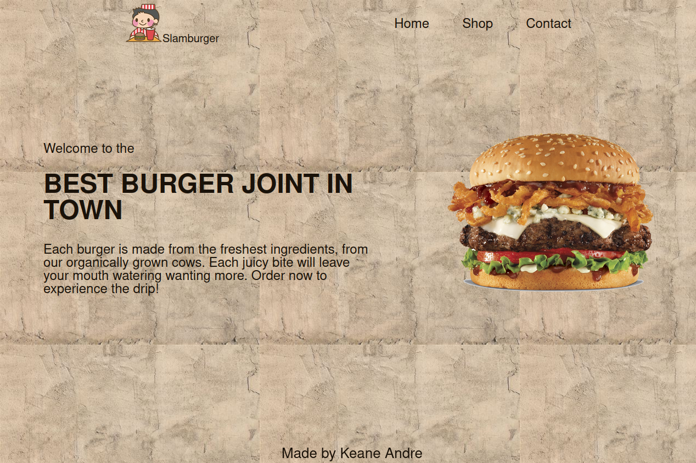

  <h1 align="center">Slamburger Restaurant Website</h1>
  

    <strong>This was the third project/task for the Full-stack JavaScript path for The Odin Project. It's a dynamically rendered website made with JavaScript. It's also meant for practicing webpack.</strong>
       
    <a href="https://keaneatl.github.io/restaurant-page/" target="_blank"><strong>Live Preview »</strong></a>
      
  

<h2 style="display: inline-block">Table of Contents</h2>
<ol>
  <li>
    <a href="#about-the-project">About The Project</a>
    <ul>
      <li><a href="#made-with">Made With</a></li>
      <li><a href="#things-i-learned">Things I Learned</a></li>
      <li><a href="#areas-of-improvement">Areas of Improvement</a></li>
    </ul>
  </li>

  <li><a href="#disclaimer">Disclaimer</a></li>
  <li><a href="#contact">Contact</a></li>
</ol>

## About The Project
### Made With
1. HTML
2. CSS
3. JavaScript
4. Webpack

### Things I Learned
1. ES6 Modules 
2. Bundling and Compiling JavaScript code using Webpack
3. Using Loaders and Plugins 

### Areas of improvement
1. Webpack proficiency 

## Disclaimer
The resources I used, specifically the custom fonts installed, backgrounds, pictures, and the svg icons are only utilized for personal use, and not otherwise. This page is not a real restaurant's website and I do not profit from the content rendered on the website.

## Contact
Keane Andre - @keaneatl (Instagram, Facebook, Twitter) - <a href="mailto:kyntltntn@protonmail.com">kyntltntn@protonmail.com</a>

